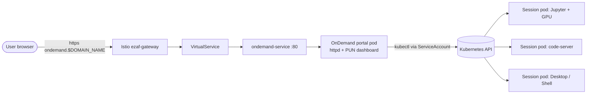

# Open OnDemand on HPE PCAI

Helm chart to deploy the [Open OnDemand](https://openondemand.org/) (OOD) web
portal on HPE Private Cloud AI (PCAI / Ezmeral Unified Analytics), wired for PCAI
networking (Istio `VirtualService`), `hpe-ezua/*` labels, and OnDemand's
**Kubernetes resource-manager adapter** so interactive apps launch as **one pod
per user session**.

> Chart structure mirrors the other frameworks in this repo (see
> [`../docling/1.35.0`](../docling/1.35.0) for the GPU reference).

---

## TL;DR — is this fully possible on PCAI?

**Partially, and honestly so.** Here is the straight answer to your three asks:

| You asked for | Verdict on PCAI |
| --- | --- |
| An **endpoint with an interface** | ✅ **Yes.** The OOD portal (dashboard, file manager, app catalog) is served at `ondemand.${DOMAIN_NAME}` through the Istio gateway. |
| A **terminal to a virtualized pod** | ⚠️ **Yes, but via a session pod, not the classic SSH Shell.** OOD's built-in *Shell* app SSHes to a login node, which does not exist in a pure-Kubernetes PCAI cluster. The browser terminal you want is delivered by launching an **interactive-app session pod** (e.g. Jupyter's terminal, `code-server`, or a shell-app image) — which is exactly the "session per pod" model. |
| **Sessions per pod creation** in PCAI | ⚠️ **Yes with caveats.** OOD natively supports Kubernetes as a job scheduler and creates a pod per session. This chart enables it in **single-namespace mode** out of the box. **True multi-user, namespace-per-user isolation needs a PCAI *cluster admin*** (cluster-scoped RBAC + login hooks) and an OOD image allowed to run its privileged `systemd` stack. |

**Why it is not a pure one-click namespaced import:**

1. **The portal container needs privilege.** OOD is Apache `httpd` + a Per-User
   NGINX (PUN) Rails dashboard started by `systemd` (`CMD ["/sbin/init"]`). It
   must run **as root** and **privileged**. PCAI enforces a restricted Pod
   Security Standard by default, so a platform admin must grant an exception.
2. **No official production image.** OSC explicitly does not ship one. You build
   it from the upstream
   [`Dockerfile.example`](https://github.com/OSC/ondemand/blob/master/Dockerfile.example)
   and push it to your PCAI registry (Harbor).
3. **Multi-user isolation is cluster-scoped.** Creating a namespace per user,
   with per-user `RoleBinding`s and a service-account token, is a cluster-admin
   operation that a namespaced framework import cannot perform on its own.

So: the **endpoint + interface + single-namespace session pods** are deliverable
from this chart. The **full multi-tenant HPC experience** is achievable with
OOD's native Kubernetes adapter but requires the admin concessions above.

---

## Architecture



- The **portal pod** renders the UI and, when a user launches an interactive
  app, calls the Kubernetes API (as its `ServiceAccount`) to create a
  **session pod**.
- Each session is its own pod, scheduled by Kubernetes, optionally requesting a
  **GPU**.

---

## What this chart deploys

| Template | Purpose |
| --- | --- |
| `deployment.yaml` | The OnDemand portal (httpd + PUN). Runs privileged/root, mounts config + a PVC, carries the `hpe-ezua/*` labels PCAI expects. |
| `service.yaml` | `ClusterIP` service on port 80. |
| `virtualService.yaml` | Istio route `ondemand.${DOMAIN_NAME}` → service (PCAI networking). |
| `pvc.yaml` | Persistent storage for user homes / session state. |
| `configmap-clusters.yaml` | `/etc/ood/config/clusters.d/pcai.yml` — the **Kubernetes adapter** config that makes app launches create pods. |
| `configmap-portal.yaml` | Optional `ood_portal.yml` (public servername for Apache/OIDC). Rendered only when `portal.servername` is set. |
| `rbac.yaml` | `ServiceAccount` + **namespaced** `Role`/`RoleBinding` so the portal can create session pods **in its own namespace** (single-namespace mode). |
| `cluster-rbac.yaml` | **Admin-gated** `ClusterRole`s for multi-user, namespace-per-user isolation. Off by default (`rbac.clusterScoped=false`). |

---

## Session-per-pod and GPUs

The portal itself is CPU-only. **GPUs are requested by the session pods**, not by
this chart's Deployment. An interactive app defines its pod in a
`submit.yml.erb`; to make a session land on a GPU, request `nvidia.com/gpu` in
its `native.container` spec — the same way the `docling` chart requests a GPU:

```yaml
# apps/bc_pytorch/submit.yml.erb  (installed on top of the portal)
---
batch_connect:
  template: "basic"
script:
  native:
    container:
      name: "pytorch"
      image: "quay.io/jupyter/pytorch-notebook:cuda12-latest"
      command: "start-notebook.sh --NotebookApp.token=''"
      port: 8888
      cpu: 2
      memory: "8Gi"
      # Request a GPU for THIS session pod:
      gpu_type: "nvidia.com/gpu"
      gpu_limit: 1
    mounts:
      - type: host
        name: home
        host_type: Directory
        path: "<%= user.home %>"
        destination_path: "<%= user.home %>"
```

> Reference: OOD [Kubernetes Jupyter tutorial](https://osc.github.io/ood-documentation/latest/tutorials/tutorials-interactive-apps/k8s-jupyter.html).
> Note that session pods created by OOD should also carry the `hpe-ezua/*`
> labels if your PCAI policies require them — add them under the app's pod
> metadata.

---

## Prerequisites and admin steps

1. **Build and push the portal image** (OSC ships none):
   ```bash
   # from a clone of https://github.com/OSC/ondemand
   docker build -t <harbor>/ondemand:4.2.4 -f Dockerfile.example .
   docker push <harbor>/ondemand:4.2.4
   ```
   Set `image.repository` / `image.tag` and `imagePullSecrets` accordingly.

2. **Allow the privileged/root portal pod** — a PCAI platform admin must permit
   this workload to run `privileged` and `runAsUser: 0` (SecurityContextConstraint
   / Kyverno exception). Required because OOD runs `systemd` + PUN.

3. **Set the public hostname** so Apache/OIDC redirects are correct behind Istio:
   ```yaml
   portal:
     servername: "ondemand.pcai.example.com"   # ${DOMAIN_NAME} resolved
   ```

4. **Authentication** — point OOD at PCAI's OIDC provider (Keycloak). Configure
   the OOD OIDC client and, for the Kubernetes adapter, ensure the token audience
   is accepted by the API server (see the
   [OIDC section](https://osc.github.io/ood-documentation/latest/installation/resource-manager/kubernetes.html#authentication)).

5. **(Optional) Multi-user isolation** — for a namespace per user:
   - Set `rbac.clusterScoped: true` (needs cluster-admin to install), and
   - Deploy OOD's per-user
     [login hooks](https://osc.github.io/ood-documentation/latest/installation/resource-manager/kubernetes.html#deploy-hooks-to-bootstrap-users-kubernetes-configuration)
     and, ideally, the
     [`job-pod-reaper`](https://github.com/OSC/job-pod-reaper) to enforce
     session walltimes.

Without step 5 the chart runs in **single-namespace mode**: every session pod is
created in the release namespace using the namespaced `Role` from `rbac.yaml`.

---

## Configuration

| Key | Default | Description |
| --- | --- | --- |
| `image.repository` | `docker.io/ohiosupercomputer/ondemand` | Portal image (build your own; see above). |
| `image.tag` | `"4.2.4"` | Image tag; defaults to chart `appVersion`. |
| `imagePullSecrets` | `[]` | Harbor pull secret(s). |
| `ezua.virtualService.endpoint` | `ondemand.${DOMAIN_NAME}` | Public host for the Istio route. |
| `ezua.virtualService.istioGateway` | `istio-system/ezaf-gateway` | PCAI gateway. |
| `service.httpPort` / `service.httpsPort` | `80` / `443` | Portal ports. |
| `portal.servername` | `""` | Public FQDN for `ood_portal.yml` (empty = skip). |
| `resources` | 1–4 CPU / 2–8Gi | Portal resources (no GPU). |
| `storage.size` / `storage.class` | `20Gi` / `gl4f-filesystem` | PVC for homes/state. |
| `podSecurityContext` / `securityContext` | root + `privileged` | Required by OOD's systemd stack. |
| `extraEnv` | `[]` | Extra env vars for the portal. |
| `clusterConfig.enabled` | `true` | Write the Kubernetes adapter cluster config. |
| `clusterConfig.namespacePrefix` | `""` | Per-user namespace prefix (empty = single-namespace). |
| `clusterConfig.sshAllow` | `false` | Disable SSH links (no login nodes). |
| `rbac.create` | `true` | Create SA + namespaced Role/RoleBinding. |
| `rbac.serviceAccountName` | `ondemand` | ServiceAccount name. |
| `rbac.clusterScoped` | `false` | Install cluster-scoped bootstrap (admin only). |
| `nodeSelector` / `tolerations` / `affinity` | `{}` / `[]` / `{}` | Scheduling. |

----

## Install / package

```powershell
# Validate
helm lint .\4.2.4\
helm template ood .\4.2.4\

# Package for the PCAI "Import Framework" UI
helm package .\4.2.4\
# -> ondemand-0.0.1.tgz
```

Upload the resulting `ondemand-0.0.1.tgz` through the PCAI **Import Framework**
UI. On first load the portal will ask you to finish authentication setup.

---

## Limitations (read before you rely on this)

- **Privileged portal pod**: OOD's systemd/PUN model needs root + privileged.
  This is the single biggest gate on a restricted PCAI cluster.
- **No bundled OOD image**: you must build and maintain your own.
- **Classic Shell app needs an SSH target**: use interactive-app session pods for
  an in-browser terminal instead.
- **Multi-user isolation is cluster-admin territory**: per-user namespaces,
  tokens, and reapers live outside a namespaced import.
- **In-cluster kube auth wiring** (mapping the portal's ServiceAccount / user
  OIDC token into the users' kube context) depends on your OOD image and PCAI
  OIDC setup and may need adjustment.

---

## References

- Open OnDemand: https://github.com/OSC/ondemand
- Kubernetes resource manager: https://osc.github.io/ood-documentation/latest/installation/resource-manager/kubernetes.html
- Kubernetes interactive app tutorial: https://osc.github.io/ood-documentation/latest/tutorials/tutorials-interactive-apps/k8s-jupyter.html
- PCAI framework porting guide: https://github.com/osadsanu/PCAI_frameworks_build
